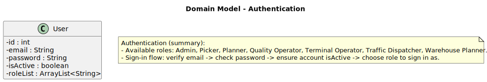
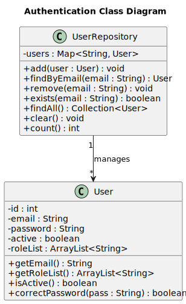

# User Authentication & Authorization

## Context/Requirement

The component responsible for user authentication and authorization (AuthLib) is implemented locally in this project and provides a small, self-contained module that other parts of the system use to authenticate users and obtain their application roles.

## AuthLib Documentation

The main concepts covered in this module are represented in the domain model presented below.

Notes about the current implementation (short):

- Roles are represented as a list of role names stored in `User.roleList` (type: `ArrayList<String>`). The most common role names used in the codebase are: `Admin`, `Picker`, `Planner`, `Quality Operator`, `Terminal Operator`, `Traffic Dispatcher`, `Warehouse Planner`.
- A `User` is uniquely identified by its `email` in the repository.

### Sign-in flow (current behaviour)
1. Controller verifies that an account with the provided email exists.
2. Controller checks the provided password against the stored value.
3. Controller verifies the `isActive` flag for the account.
4. If successful, the controller returns the list of available role names for the user to select which role to sign in as; the UI then navigates to the role-specific home page.

> Implementation note: the current code stores passwords in plain text (see `User.password`). For production use, replace this with a salted password hash and validate with a secure hash check.

## Public API (what other modules use)

This module exposes user management via the `UserRepository`. The repository is keyed by email and exposes the following operations (method names adapted to the implementation):

* `void add(User user)` — add a new user to the repository
* `User findByEmail(String email)` — retrieve a user by email (current implementation throws if not found)
* `void remove(String email)` — remove a user by email
* `boolean exists(String email)` — check whether a user with the given email exists
* `Collection<User> findAll()` — return all users
* `void clear()` — clear the repository
* `int count()` — number of users

The `User` entity provides the following commonly used methods:

* `String getEmail()`
* `ArrayList<String> getRoleList()`
* `boolean isActive()`
* `boolean correctPassword(String pass)`

## Where to find the implementation
- Domain entity: `src/main/java/pt/ipp/isep/dei/domain/User.java`
- Repository (in-memory implementation): `src/main/java/pt/ipp/isep/dei/repository/UserRepository.java`
- Controllers handling registration and sign-in:
  - `src/main/java/pt/ipp/isep/dei/controller/acountRelated/SignInController.java`
  - `src/main/java/pt/ipp/isep/dei/controller/acountRelated/RegisterController.java`
  - `src/main/java/pt/ipp/isep/dei/controller/admin/AdminEditUserController.java`

