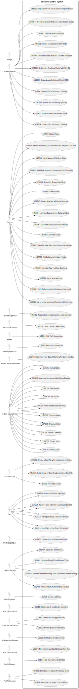

# Use Case Diagram (UCD)

**In the scope of this project, there is a direct relationship of _1 to 1_ between Use Cases (UC) and User Stories (US).**

# Use Cases / User Stories
| UC/US  | Description                                                                                                |
|:-------|:-----------------------------------------------------------------------------------------------------------|
| USAC01 | [Encrypt Data](../../USXX/ARQCP/sprint_2/USAC01/USAC01-README.md)                                          |
| USAC02 | [Decrypt Data](../../USXX/ARQCP/sprint_2/USAC02/USAC02-README.md)                                          |
| USAC03 | [Extract Data](../../USXX/ARQCP/sprint_2/USAC03/USAC03-README.md)                                          |
| USAC04 | [Format Command](../../USXX/ARQCP/sprint_2/USAC04/USAC04-README.md)                                        |
| USAC05 | [Enqueue Value](../../USXX/ARQCP/sprint_2/USAC05/USAC05-README.md)                                         |
| USAC06 | [Dequeue Value](../../USXX/ARQCP/sprint_2/USAC06/USAC06-README.md)                                         |
| USAC07 | [Move N Elements to an Array](../../USXX/ARQCP/sprint_2/USAC07/USAC07-README.md)                           |
| USAC08 | [Sort Array](../../USXX/ARQCP/sprint_2/USAC08/USAC08-README.md)                                            |
| USAC09 | [Find Median](../../USXX/ARQCP/sprint_2/USAC09/USAC09-README.md)                                           |
| USAC10 | [Assemble Sensors and LightSigns Devices](../../USXX/ARQCP/sprint_3/USAC10/USAC10-README.md)               | 
| USAC11 | [Initial Data Setup via Text File](../../USXX/ARQCP/sprint_3/USAC11/USAC11-README.md)                      | 
| USAC12 | [Generate User Action Sequence Text File](../../USXX/ARQCP/sprint_3/USAC12/USAC12-README.md)               | 
| USAC13 | [Retrieve Data from Sensors Component](../../USXX/ARQCP/sprint_3/USAC13/USAC13-README.md)                  | 
| USAC14 | [Control Track Sign Light](../../USXX/ARQCP/sprint_3/USAC14/USAC14-README.md)                              | 
| USAC15 | [Send Data to Board Component](../../USXX/ARQCP/sprint_3/USAC15/USAC15-README.md)                          | 
| USAC16 | [Manage Station Railway Tracks](../../USXX/ARQCP/sprint_3/USAC16/USAC16-README.md)                         |
| USBD01 | [Create Data Dictionary / Glossary](../../USXX/BDDAD/sprint_1/USBD01/USBD01-README.md)                     |
| USBD02 | [Design Logical Relational Model (ERD)](../../USXX/BDDAD/sprint_1/USBD02/USBD02-README.md)                 |
| USBD03 | [Instantiate Relational Model with SQL DDL](../../USXX/BDDAD/sprint_1/USBD03/USBD03-README.md)             |
| USBD04 | [Insert Provided Data Into The New Database](../../USXX/BDDAD/sprint_1/USBD04/USBD04-README.md)            |
| USBD05 | [List All Line Segments Connecting Two Endpoints](../../USXX/BDDAD/sprint_1/USBD05/USBD05-README.md)       |
| USBD10 | [List All Wagons Of A Given Type](../../USXX/BDDAD/sprint_1/USBD10/USBD10-README.md)                       |
| USBD16 | [Get Minimum Length Of Double-Track Segments In A Line](../../USXX/BDDAD/sprint_1/USBD16/USBD16-README.md) |
| USBD21 | [Update Relational Model](../../USXX/BDDAD/sprint_2/USBD21/USBD21-README.md)                               |
| USBD23 | [List of all line segments of a planned train route](../../USXX/BDDAD/sprint_2/USBD23/USBD23-README.md)    |
| USBD25 | [List of all endpoints of a planned train route](../../USXX/BDDAD/sprint_2/USBD25/USBD25-README.md)        |
| USBD27 | [List of grain wagons](../../USXX/BDDAD/sprint_2/USBD27/USBD27-README.md)                                  |
| USBD31 | [Update and Instantiate Relational Model in Oracle](../../USXX/BDDAD/sprint_3/USBD31/USBD31-README.md)     | 
| USBD32 | [Populate Database for Sprint 3 Testing](../../USXX/BDDAD/sprint_3/USBD32/USBD32-README.md)                | 
| USBD33 | [Prevent Trains Exceeding Maximum Allowed Length](../../USXX/BDDAD/sprint_3/USBD33/USBD33-README.md)       | 
| USBD35 | [Register New Facility in Database](../../USXX/BDDAD/sprint_3/USBD35/USBD35-README.md)                     | 
| USBD36 | [Add Building to Existing Facility](../../USXX/BDDAD/sprint_3/USBD36/USBD36-README.md)                     | 
| USBD37 | [Register New Wagon with Supported Gauges](../../USXX/BDDAD/sprint_3/USBD37/USBD37-README.md)              | 
| USBD38 | [Add New Gauge](../../USXX/BDDAD/sprint_3/USBD38/USBD38-README.md)                                         | 
| USBD41 | [Remove Freight from Planned Train](../../USXX/BDDAD/sprint_3/USBD41/USBD41-README.md)                     | 
| USBD43 | [Add New Electric Locomotive Model](../../USXX/BDDAD/sprint_3/USBD43/USBD43-README.md)                     | 
| USBD44 | [Add Line Segment and Optional Siding](../../USXX/BDDAD/sprint_3/USBD44/USBD44-README.md)                  | 
| USBD45 | [Create New Line with Initial Segment](../../USXX/BDDAD/sprint_3/USBD45/USBD45-README.md)                  |
| USEI01 | [Wagons Unloading (Inventory replenishment)](../../USXX/ESINF/sprint_1/USEI01/USEI01-README.md)            |
| USEI02 | [Order Eligibility & Allocation](../../USXX/ESINF/sprint_1/USEI02/USEI02-README.md)                        |
| USEI03 | [Picking Plans](../../USXX/ESINF/sprint_1/USEI03/USEI03-README.md)                                         |
| USEI04 | [Pick Path Sequencing](../../USXX/ESINF/sprint_1/USEI04/USEI04-README.md)                                  |
| USEI05 | [Returns & Quarantine](../../USXX/ESINF/sprint_1/USEI05/USEI05-README.md)                                  |
| USEI06 | [Create Trees](../../USXX/ESINF/sprint_2/USEI06/USEI06-README.md)                                          |
| USEI07 | [Create a 2D Tree](../../USXX/ESINF/sprint_2/USEI07/USEI07-README.md)                                      |
| USEI08 | [Search by Geographical Area](../../USXX/ESINF/sprint_2/USEI08/USEI08-README.md)                           |
| USEI09 | [Proximity Search](../../USXX/ESINF/sprint_2/USEI09/USEI09-README.md)                                      |
| USEI10 | [Radius search and density summary](../../USXX/ESINF/sprint_2/USEI10/USEI10-README.md)                     |
| USEI11 | [Directed Line Upgrade Plan](../../USXX/ESINF/sprint_3/USEI11/USEI11-README.md)                            |
| USEI12 | [Minimal Backbone Network](../../USXX/ESINF/sprint_3/USEI12/USEI12-README.md)                              |
| USEI13 | [Rail Hub Centrality Analysis](../../USXX/ESINF/sprint_3/USEI13/USEI13-README.md)                          |
| USEI14 | [Maximum throughput between two Hubs](../../USXX/ESINF/sprint_3/USEI14/USEI14-README.md)                   |
| USEI15 | [Risk-Aware Shortest Paths](../../USXX/ESINF/sprint_3/USEI15/USEI15-README.md)                             |
| USLP01 | [Create Conceptual Domain Model](../../USXX/LAPR3/sprint_1/USLP01/USLP01-README.md)                        |
| USLP02 | [Implement Text-Based Interface for Cargo Handling](../../USXX/LAPR3/sprint_1/USLP02/USLP02-README.md)     |
| USLP03 | [Estimated Travel Time Calculation](../../USXX/LAPR3/sprint_1/USLP03/USLP03-README.md)                     |
| USLP04 | [Update Data Dictionary / Glossary](../../USXX/LAPR3/sprint_2/USLP04/USLP04-README.md)                     |
| USLP05 | [Update conceptual domain model](../../USXX/LAPR3/sprint_2/USLP05/USLP05-README.md)                        |
| USLP06 | [Update data dictionary/glossary](../../USXX/LAPR3/sprint_2/USLP06/USLP06-README.md)                       |
| USLP07 | [Dispatch a list of trains](../../USXX/LAPR3/sprint_2/USLP07/USLP07-README.md)                             |
| USLP08 | [Plan Routes to Fulfil Pending Freights](../../USXX/LAPR3/sprint_3/USLP08/USLP08-README.md)                |
| USLP09 | [Assemble and Assign Train to Route](../../USXX/LAPR3/sprint_3/USLP09/USLP09-README.md)                    |
| USLP10 | [Schedule and Dispatch Trains by Route](../../USXX/LAPR3/sprint_3/USLP10/USLP10-README.md)                 |

